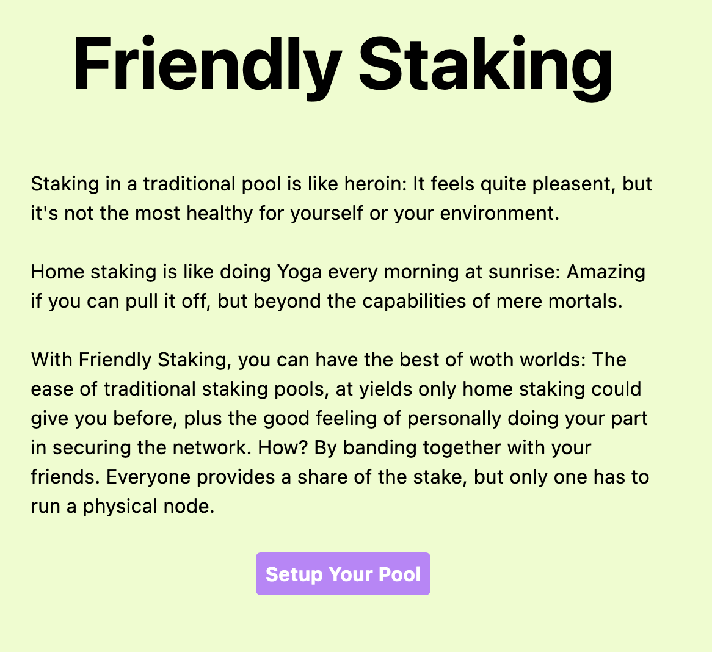

# Friendly Staking

Home staking is super hard! You have to run a node on powerful hardware, monitor it constantly, make sure it stays up-to-date, and even if everything works fine, you end up worrying about it anyways. That's why most stakers trust in staking pools, like LIDO, Rocket Pool, or even fully centralized providers. However, their market dominance is a serious threat to Ethereum's security. It can also be seen as a serious capital misallocation, as 1ETH sent to LIDO results in much less marginal security compared to giving it to a home staker. Last but not least, they take high fees.

Friendly Staking combines the best of home staking with the best of staking pools. It's based on the premise that while almost no one wants to run a node, almost everyone knows someone who does. Friendly Staking allows groups of friends to easily and safely pool money and automatically split the rewards. Through social pressure, the group still has political influence on the node, making friendly staked ETH more valuable to the network compared to traditional pools.

## Usage

Run the frontend with `npm run dev` in `/frontend/`. Compile the contracts with `npx hardhat compile` in `/contracts/` and deploy them with `npx hardhat deploy --network <network>`.
